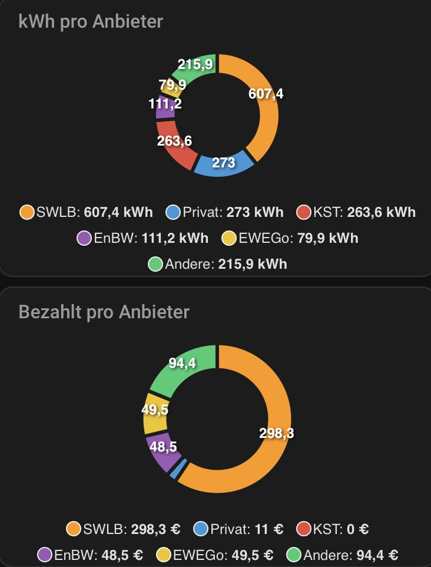
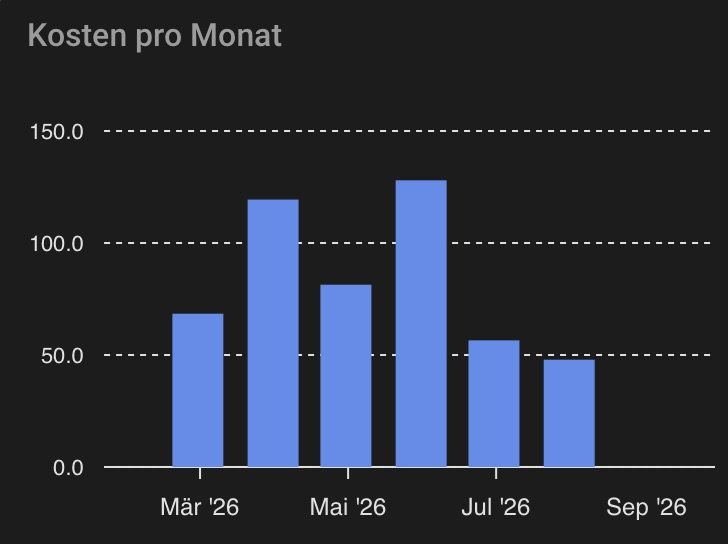
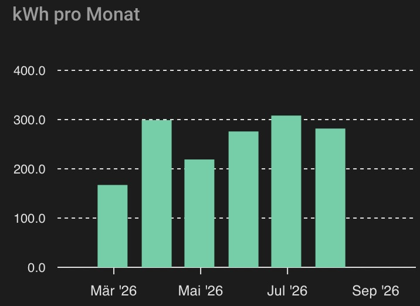
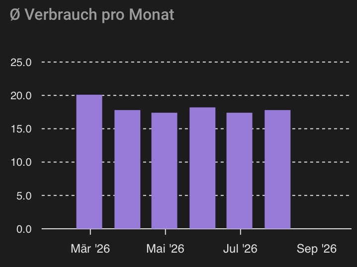

# Lademonitor – Home Assistant Integration

[](LICENSE)

HACS-Integration für [Lademonitor-Server](https://github.com/iDomi94/Lademonitor-Server)
(selbstgehostete Ladevorgang-Tracking-App für ein E-Auto). Holt Statistiken
(Kosten, Verbrauch, gefahrene km, AC/DC-Anteil) als Sensoren in Home
Assistant und stellt Services bereit, um automatisch erkannte Ladevorgänge
an den Server zu übertragen.

Login/Token-Handling läuft komplett über die Integration (Einrichtungsdialog
fragt Server-URL + Zugangsdaten einmalig ab, Token wird intern verwaltet und
bei Bedarf automatisch erneuert) – für Automationen ist kein eigenes
Auth-Handling nötig.

## Installation (HACS Custom Repository)

Solange die Integration nicht im HACS-Standard-Store gelistet ist:

1. HACS → Integrationen → Menü (⋮) → *Benutzerdefinierte Repositories*
2. URL dieses Repos eintragen, Kategorie *Integration*
3. „Lademonitor" installieren, Home Assistant neu starten
4. **Einstellungen → Geräte & Dienste → Integration hinzufügen → Lademonitor**
5. Server-URL, Benutzername und Passwort deines Lademonitor-Accounts eingeben
   (der Account, dem das Fahrzeug gehört – siehe Hinweis zur
   Pro-Nutzer-Datentrennung in `Lademonitor-Server/CLAUDE.md`)

## Sensoren

Pro Fahrzeug (aus `GET /api/vehicles`) ein Device mit: Gesamtkosten,
Gesamt-kWh, Ø Preis/kWh, Ø Verbrauch kWh/100km, Kosten/100km, gefahrene km
gesamt, AC-/DC-Anteil, Anzahl Ladevorgänge. Abfrageintervall über die
Integrations-Optionen einstellbar (Standard 15 Minuten).

Einige Sensoren tragen zusätzlich die Monats-/Anbieter-Aufschlüsselung aus
`GET /api/stats/summary` als Attribut, statt eigener Sensoren dafür:

| Sensor | Attribut(e) |
| --- | --- |
| Gesamtkosten | `monthly` (Monat + Kosten), `by_provider` (Anbieter + Kosten) |
| Gesamt geladene Energie | `monthly` (Monat + kWh), `by_provider` (Anbieter + kWh) |
| Ø Verbrauch | `monthly` (Monat + Ø Verbrauch) |
| Ladevorgänge | `monthly` (Monat + Anzahl Ladevorgänge) |
| AC-Anteil / DC-Anteil | `ac_kwh` / `dc_kwh` (absoluter Wert statt nur Prozent) |

Nutzbar z.B. mit `custom:apexcharts-card` (HACS) für Anbieter-Kuchen- oder
Monats-Balkendiagramme wie in App/Web-UI – mit nativen Lovelace-Karten
lassen sich Listen-Attribute nicht direkt als Chart darstellen.

## Ladevorgänge automatisch übertragen

Für eine Automation, die Ladebeginn und Ladeende an zwei unterschiedlichen
Zeitpunkten erkennt (z.B. über einen Lade-Status-Sensor), gibt es zwei
Services, die zusammenspielen – SoC-Start/Startzeit/Lade-Art müssen dafür
**nirgends selbst zwischengespeichert werden** (kein `input_text`/
`input_number` nötig), die Integration merkt sich das intern und persistent
(übersteht auch einen HA-Neustart mitten im Ladevorgang):

- **`lademonitor.begin_charging_session`** – beim Einstecken/Ladebeginn
  aufrufen, merkt `soc_start`/`charging_type` intern (Startzeit wird
  automatisch auf „jetzt" gesetzt). Überträgt noch nichts an den Server.
- **`lademonitor.end_charging_session`** – bei Ladeende aufrufen, holt die
  gemerkten Werte wieder heraus, kombiniert sie mit den hier übergebenen
  Endwerten und **überträgt den kompletten Ladevorgang an den Server**
  (entspricht `POST /api/sessions/auto`).

### Blueprint (empfohlen)

[](https://my.home-assistant.io/redirect/blueprint_import/?blueprint_url=https%3A%2F%2Fraw.githubusercontent.com%2FiDomi94%2FLademonitor-HA%2Fmain%2Fblueprints%2Fautomation%2Flademonitor%2Fcharging_session.yaml)

Deckt `begin_charging_session`/`end_charging_session` ab, inklusive
optionaler Mobile-App-Benachrichtigung bei Ladeende („Ladevorgang zu
Lademonitor gesendet: Start … → Ende …, SoC …% → …%, AC/DC"). Einfach über
den Button importieren und im Formular den Lade-Status-Sensor, Akkustand-
Sensor sowie (optional) Lade-Art-/Kilometerstand-/Standort-Sensor und die
Notify-Entity für die Benachrichtigung auswählen – Ruhezustand/aktive
Zustände sind mit den Enyaq/MySkoda-Werten vorbelegt, aber für andere
Fahrzeuge anpassbar. Quelle:
[`blueprints/automation/lademonitor/charging_session.yaml`](blueprints/automation/lademonitor/charging_session.yaml).

Der Import-Button verlinkt einfach auf eine rohe YAML-Datei – dafür braucht
es kein Gist, eine Raw-GitHub-URL aus einem öffentlichen Repo (wie hier)
funktioniert genauso.

Die Benachrichtigung nutzt die bei `end_charging_session` neu eingeführte
Service-Response: Der Service liefert den kompletten übertragenen
Ladevorgang (inkl. der bei `begin_charging_session` gemerkten Startwerte)
zurück, abrufbar per `response_variable` – für eigene Automationen z.B. so:

```yaml
- action: lademonitor.end_charging_session
  data:
    vehicle_external_id: enyaq
    soc_end: "{{ states('sensor.skoda_enyaq_battery_percentage') | int }}"
  response_variable: lademonitor_session
- action: notify.send_message
  target:
    entity_id: notify.mein_handy
  data:
    message: >-
      Ladevorgang zu Lademonitor gesendet: Start
      {{ lademonitor_session.start_time }} → Ende {{ lademonitor_session.end_time }},
      SoC {{ lademonitor_session.soc_start }}% → {{ lademonitor_session.soc_end }}%,
      {{ lademonitor_session.charging_type }}
```

### Manuell (ohne Blueprint)

Vollständiges Beispiel für MySkoda/Škoda Enyaq (dieselbe Logik lässt sich auf
jedes Fahrzeug übertragen, das einen Lade-Status-Sensor mit einem
"eingesteckt, aber nicht ladend"-Zustand liefert). Der Škoda-Sensor
`sensor.skoda_enyaq_charging_state` kennt fünf Werte: `connect_cable`
(Ruhezustand/Standard) sowie `ready_for_charging`, `conserving`, `charging`,
`charging_interrupted` (alle vier = „verbunden/aktiv"). Die Session-Grenze
ist der Übergang zwischen `connect_cable` und einem der vier aktiven Werte:

Direkt so in **Einstellungen → Automationen → Automation erstellen → In YAML
bearbeiten** einfügbar (kein `automation:`-Wrapper, kein `id:` nötig – die
UI legt beides selbst an; für `automations.yaml`/ein Package siehe Hinweis
unten):

```yaml
alias: Enyaq Ladevorgang → Lademonitor
triggers:
  - trigger: state
    entity_id: sensor.skoda_enyaq_charging_state
actions:
  - choose:
      # connect_cable -> aktiver Zustand: Ladung beginnt, Startwerte merken
      - conditions:
          - condition: template
            value_template: >-
              {{ trigger.from_state.state == 'connect_cable'
                 and trigger.to_state.state in
                   ['ready_for_charging','conserving','charging','charging_interrupted'] }}
        sequence:
          - action: lademonitor.begin_charging_session
            data:
              vehicle_external_id: enyaq
              soc_start: "{{ states('sensor.skoda_enyaq_battery_percentage') }}"
              # Sensor liefert klein ('ac'/'dc') - Server normalisiert das selbst.
              charging_type: "{{ states('sensor.skoda_enyaq_charge_type') }}"
      # aktiver Zustand -> connect_cable: Ladung beendet, Push an Lademonitor
      - conditions:
          - condition: template
            value_template: >-
              {{ trigger.from_state.state in
                   ['ready_for_charging','conserving','charging','charging_interrupted']
                 and trigger.to_state.state == 'connect_cable' }}
        sequence:
          - action: lademonitor.end_charging_session
            data:
              vehicle_external_id: enyaq
              soc_end: "{{ states('sensor.skoda_enyaq_battery_percentage') | int }}"
              odometer_km: "{{ states('sensor.skoda_enyaq_mileage') | int }}"
              latitude: "{{ state_attr('device_tracker.skoda_enyaq_position', 'latitude') }}"
              longitude: "{{ state_attr('device_tracker.skoda_enyaq_position', 'longitude') }}"
            response_variable: lademonitor_session
          - action: notify.send_message
            target:
              entity_id: notify.mein_handy
            data:
              message: >-
                Ladevorgang zu Lademonitor gesendet: Start
                {{ lademonitor_session.start_time }} → Ende {{ lademonitor_session.end_time }},
                SoC {{ lademonitor_session.soc_start }}% → {{ lademonitor_session.soc_end }}%,
                {{ lademonitor_session.charging_type }}
```

`notify.mein_handy` durch die eigene Notify-Entity der Home Assistant App
ersetzen (Einstellungen → Geräte & Dienste → Entitäten → Domäne „notify").
`response_variable` greift auf die neu eingeführte Service-Response von
`end_charging_session` zu (siehe Blueprint-Abschnitt oben) – so müssen
Start-SoC/-Zeit/Lade-Art für die Benachrichtigung nicht separat gemerkt
werden.

Für `automations.yaml` oder ein eigenes Package stattdessen als Listeneintrag
unter dem Top-Level-Key `automation:` ablegen, mit einer zusätzlichen eigenen
`id:` (z.B. `id: enyaq_lademonitor_push`) vor `alias:` – dieselben Felder,
nur eine Einrückungsebene tiefer.

`energy_kwh` wird bewusst nicht mitgeschickt – der Server schätzt es
serverseitig zuverlässiger aus SoC-Delta × Akkukapazität (MySkoda liefert
keine verlässliche kWh-Angabe). Ruft man `end_charging_session` für ein
Fahrzeug auf, ohne dass vorher `begin_charging_session` lief (z.B. HA neu
gestartet, während das Auto schon lud), schlägt der Service mit einer
klaren Fehlermeldung fehl statt einen unvollständigen Datensatz zu senden.

### Alternative: alle Werte in einem Aufruf

Liegen Start- und Endwerte bereits gemeinsam vor (z.B. eine Quelle, die den
kompletten Ladevorgang erst im Nachhinein liefert, statt Beginn und Ende als
getrennte Ereignisse), überträgt **`lademonitor.push_charging_session`** den
Ladevorgang in einem einzigen Aufruf – kein vorheriges `begin_charging_session`
nötig:

```yaml
action: lademonitor.push_charging_session
data:
  vehicle_external_id: enyaq
  external_session_id: "{{ session.id }}"
  start_time: "{{ session.start }}"
  end_time: "{{ session.end }}"
  charging_type: "{{ session.charging_type }}"
  soc_start: "{{ session.soc_start }}"
  soc_end: "{{ session.soc_end }}"
  odometer_km: "{{ session.odometer_km }}"
  latitude: "{{ session.latitude }}"
  longitude: "{{ session.longitude }}"
```

## Bekannte Einschränkung

Fahrzeuge werden beim Einrichten der Integration einmal geladen. Ein später
im Server neu angelegtes Fahrzeug erscheint erst nach einem Neuladen der
Integration (Einstellungen → Geräte & Dienste → Lademonitor → Neu laden).

## Dashboard-Karten

Im selben Stil wie das Dashboard in App/Web-UI: ein Kachel-Raster mit den
Summen-Werten, darunter der AC/DC-Anteil als zwei Gauges in Blau/Orange
(entspricht dem AC/DC-Balken in App/Web-UI). Anbieter-Kuchendiagramme und
Monats-Charts wie in App/Web-UI gibt es weiter unten unter „Anbieter- und
Monats-Charts" – dafür reichen native Lovelace-Karten aber nicht mehr aus.

Kein fertiges Dashboard zum Importieren (Lovelace kennt anders als
Automation-Blueprints keinen URL-Import) – stattdessen unten einzelne
Karten zum Kopieren in ein bestehendes Dashboard: **Dashboard bearbeiten →
Karte hinzufügen → oben rechts „Manuell" → Inhalt einfügen**. Vorher überall
`sensor.skoda_enyaq_...` per Suchen&Ersetzen auf die eigenen entity_ids
anpassen (Entwicklertools → Zustände → nach dem Fahrzeugnamen filtern) –
pro weiterem Fahrzeug einfach nochmal mit anderem Präfix einfügen.

Die `entity_id`s unten orientieren sich am Škoda Enyaq mit englischer
HA-Sprache (Gerätename "Skoda Enyaq" → Präfix `skoda_enyaq`, Rest aus den
englischen Entity-Namen in
[`translations/en.json`](custom_components/lademonitor/translations/en.json)
abgeleitet, z.B. `total_sessions` → "Charging sessions" →
`sensor.skoda_enyaq_charging_sessions`) – bei deutscher HA-Sprache oder
einem anderen Fahrzeugnamen weichen die tatsächlichen IDs davon ab, siehe
Hinweis oben.

Kachel-Raster mit den sieben Summen-Werten:

<details>
<summary>YAML anzeigen</summary>

```yaml
type: grid
columns: 2
square: false
cards:
  - type: tile
    entity: sensor.skoda_enyaq_charging_sessions
    name: Ladevorgänge
    icon: mdi:ev-station
  - type: tile
    entity: sensor.skoda_enyaq_total_energy_charged
    name: Gesamt kWh
    icon: mdi:lightning-bolt
  - type: tile
    entity: sensor.skoda_enyaq_total_cost
    name: Gesamtkosten
    icon: mdi:currency-eur
  - type: tile
    entity: sensor.skoda_enyaq_average_price_per_kwh
    name: "Ø Preis/kWh"
    icon: mdi:cash-multiple
  - type: tile
    entity: sensor.skoda_enyaq_average_consumption
    name: "Ø Verbrauch/100km"
    icon: mdi:speedometer
  - type: tile
    entity: sensor.skoda_enyaq_cost_per_100_km
    name: Preis/100km
    icon: mdi:currency-eur
  - type: tile
    entity: sensor.skoda_enyaq_total_distance_driven
    name: Gefahrene Kilometer
    icon: mdi:map-marker-distance
```

</details>

AC/DC-Anteil als zwei Gauges nebeneinander:

<details>
<summary>YAML anzeigen</summary>

```yaml
type: horizontal-stack
cards:
  - type: gauge
    entity: sensor.skoda_enyaq_ac_share
    name: AC
    min: 0
    max: 100
    segments:
      - from: 0
        color: "#2196f3"
      - from: 100
        color: "#2196f3"
  - type: gauge
    entity: sensor.skoda_enyaq_dc_share
    name: DC
    min: 0
    max: 100
    segments:
      - from: 0
        color: "#ff9800"
      - from: 100
        color: "#ff9800"
```

</details>

### Anbieter- und Monats-Charts (Voraussetzung: `apexcharts-card`)

Für die Anbieter-Kuchendiagramme und Monats-Balken aus App/Web-UI reichen
native Lovelace-Karten nicht mehr – die Daten liegen als Listen-Attribute
(`monthly`, `by_provider`, siehe oben) an den Sensoren, und die kann nur
eine Karte mit eigenem `data_generator` in ein Chart umwandeln. Dafür vorher
[`apexcharts-card`](https://github.com/RomRider/apexcharts-card) über HACS
→ Frontend installieren (kein Bestandteil von Home Assistant selbst).

Anbieter-Verteilung, kWh und Kosten untereinander (Donut, wie im Web-UI).



Wichtig: Bei `chart_type: donut`/`pie` steht **eine Serie für genau eine
Slice** (`apexcharts-card` nimmt pro Serie den letzten berechneten Wert) -
es gibt keinen Automatismus, der eine Liste wie `by_provider` von selbst in
mehrere Slices auffächert, und der Name einer Serie ist ein statischer
YAML-Wert (nicht per `data_generator` dynamisch benennbar). Deshalb sechs
feste Serien-Slots ("Platz 1"–"Platz 5" + "Andere"), deren **Werte** aber
automatisch aus `by_provider` befüllt werden – der Server liefert die Liste
bereits absteigend nach kWh sortiert (siehe `Lademonitor-Server/CLAUDE.md`),
Index 0–4 sind also automatisch die fünf größten Anbieter, alles ab Index 5
läuft automatisch in "Andere". Die Entität wird dafür einmal per
YAML-Anker (`&kwh_entity`/`&cost_entity`) gesetzt und in den restlichen
Serien nur noch referenziert (`*kwh_entity`/`*cost_entity`):

<details>
<summary>YAML anzeigen</summary>

```yaml
type: vertical-stack
cards:
  - type: custom:apexcharts-card
    header:
      show: true
      title: kWh pro Anbieter
    chart_type: donut
    apex_config:
      chart:
        height: 200px
    series:
      - entity: &kwh_entity sensor.skoda_enyaq_total_kwh
        name: Platz 1
        data_generator: |
          const p = entity.attributes.by_provider[0];
          return [[Date.now(), p ? p.total_kwh : 0]];
      - entity: *kwh_entity
        name: Platz 2
        data_generator: |
          const p = entity.attributes.by_provider[1];
          return [[Date.now(), p ? p.total_kwh : 0]];
      - entity: *kwh_entity
        name: Platz 3
        data_generator: |
          const p = entity.attributes.by_provider[2];
          return [[Date.now(), p ? p.total_kwh : 0]];
      - entity: *kwh_entity
        name: Platz 4
        data_generator: |
          const p = entity.attributes.by_provider[3];
          return [[Date.now(), p ? p.total_kwh : 0]];
      - entity: *kwh_entity
        name: Platz 5
        data_generator: |
          const p = entity.attributes.by_provider[4];
          return [[Date.now(), p ? p.total_kwh : 0]];
      - entity: *kwh_entity
        name: Andere
        data_generator: |
          const p = entity.attributes.by_provider[5];
          return [[Date.now(), p ? p.total_kwh : 0]];
  - type: custom:apexcharts-card
    header:
      show: true
      title: Bezahlt pro Anbieter
    chart_type: donut
    apex_config:
      chart:
        height: 200px
    series:
      - entity: &cost_entity sensor.skoda_enyaq_total_cost
        name: Platz 1
        data_generator: |
          const p = entity.attributes.by_provider[0];
          return [[Date.now(), p ? p.total_cost : 0]];
      - entity: *cost_entity
        name: Platz 2
        data_generator: |
          const p = entity.attributes.by_provider[1];
          return [[Date.now(), p ? p.total_cost : 0]];
      - entity: *cost_entity
        name: Platz 3
        data_generator: |
          const p = entity.attributes.by_provider[2];
          return [[Date.now(), p ? p.total_cost : 0]];
      - entity: *cost_entity
        name: Platz 4
        data_generator: |
          const p = entity.attributes.by_provider[3];
          return [[Date.now(), p ? p.total_cost : 0]];
      - entity: *cost_entity
        name: Platz 5
        data_generator: |
          const p = entity.attributes.by_provider[4];
          return [[Date.now(), p ? p.total_cost : 0]];
      - entity: *cost_entity
        name: Andere
        data_generator: |
          const p = entity.attributes.by_provider[5];
          return [[Date.now(), p ? p.total_cost : 0]];
```

</details>

`by_provider` ist bereits serverseitig auf Top-5-+-„Andere" gruppiert
(`sensor.py::_grouped_by_provider`, Port derselben Regel wie in App/Web-UI:
„Ohne Anbieter" landet unabhängig von seiner Größe immer in „Andere", nie
als eigene Slice) – die Karte muss also nur noch stumpf `by_provider[0..5]`
auslesen, kein Sortieren/Filtern/Aufsummieren mehr in der Karten-YAML.

Wichtig zu wissen: Die Anbieter-**Reihenfolge** (welcher Anbieter "Platz 1"
ist) ist damit voll automatisch – der jeweilige **Name** in Legende/Tooltip
bleibt aber der statische Platzhalter "Platz 1" usw., weil `apexcharts-card`
Serien-Namen nicht aus `data_generator` ableiten kann. Wer die echten
Anbieternamen in der Legende sehen will, muss "Platz 1"–"Platz 5" von Hand
durch die aktuell führenden Anbieter ersetzen (Entwicklertools → Zustände,
`by_provider`-Reihenfolge ablesen) – nur dann bei einer Rangänderung erneut
nötig, die Werte/Gruppierung selbst bleiben immer korrekt.

`apex_config` reicht rohe ApexCharts.js-Optionen durch (`chart.height` oben
verkleinert den Durchmesser – ApexCharts richtet den Kreis an der kleineren
der beiden Dimensionen aus, kleinerer Wert = kleinerer Kreis). Für einen
dünneren Ring statt eines kleineren Kreises stattdessen
`plotOptions.pie.donut.size` (z.B. `"75%"`) setzen.

Kosten pro Monat (Balken):



<details>
<summary>YAML anzeigen</summary>

```yaml
type: custom:apexcharts-card
header:
  show: true
  title: Kosten pro Monat
graph_span: 180d
series:
  - entity: sensor.skoda_enyaq_total_cost
    type: column
    name: Kosten
    color: "#5b8def"
    data_generator: |
      return entity.attributes.monthly
        .slice()
        .reverse()
        .map(m => [new Date(m.month + "-01").getTime(), m.total_cost]);
```

</details>

kWh pro Monat (Balken):



<details>
<summary>YAML anzeigen</summary>

```yaml
type: custom:apexcharts-card
header:
  show: true
  title: kWh pro Monat
graph_span: 180d
series:
  - entity: sensor.skoda_enyaq_total_kwh
    type: column
    name: kWh
    color: "#4fd1a5"
    data_generator: |
      return entity.attributes.monthly
        .slice()
        .reverse()
        .map(m => [new Date(m.month + "-01").getTime(), m.total_kwh]);
```

</details>

Ø Verbrauch pro Monat (Balken, Monate ohne berechenbaren Wert werden
übersprungen):



<details>
<summary>YAML anzeigen</summary>

```yaml
type: custom:apexcharts-card
header:
  show: true
  title: Ø Verbrauch pro Monat
graph_span: 180d
series:
  - entity: sensor.skoda_enyaq_average_consumption
    type: column
    name: kWh/100km
    color: "#9b7bde"
    data_generator: |
      return entity.attributes.monthly
        .slice()
        .reverse()
        .filter(m => m.avg_consumption_kwh_per_100km != null)
        .map(m => [new Date(m.month + "-01").getTime(), m.avg_consumption_kwh_per_100km]);
```

</details>

`graph_span` ist ein statischer Wert (kein `data_generator`-Ausdruck) - es
gibt in `apexcharts-card` keine dokumentierte Möglichkeit, das Zeitfenster
automatisch an die tatsächlich vorhandene Anzahl Monate anzupassen. `180d`
oben passt zum aktuellen Datenstand (~6 Monate); wächst die Monats-Historie
darüber hinaus, muss der Wert von Hand hochgesetzt werden. Bewusst in Tagen
statt `6month`/`1year`: Die `apexcharts-card`-Doku warnt ausdrücklich, dass
`month`/`year`-Einheiten bei `graph_span` "inconsistent result[s]" liefern
können, und empfiehlt Tage. Großzügiger wählen (z.B. `730d` für ~2 Jahre)
spart künftiges Nachjustieren, zeigt bis dahin aber etwas Leerraum am Rand.

`monthly` kommt vom Server absteigend sortiert (neuester Monat zuerst,
siehe `Lademonitor-Server/CLAUDE.md`) – das `.slice().reverse()` sorgt dafür,
dass der Zeitverlauf wie im Web-UI von links nach rechts läuft.
